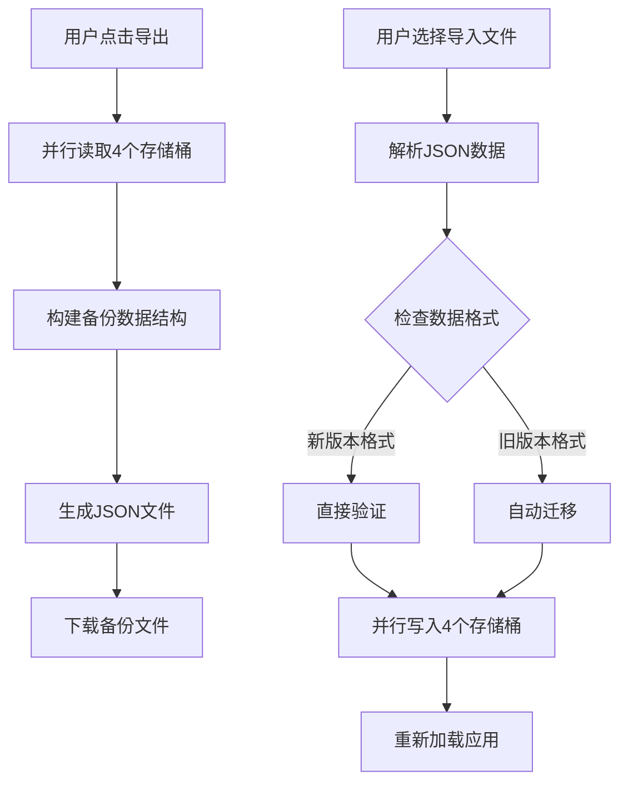

# JChat 数据备份系统

## 概述

JChat 现在采用全新的数据存储架构，基于 **zustand + localforage (IndexedDB)**，所有数据分布在 4 个独立的存储桶中。相应地，我们重构了完整的数据导入导出系统，确保所有数据都能被完整备份和恢复。

## 数据存储架构

### 4 个 IndexedDB 存储桶

1. **`default` 存储桶**

   - 存储内容：zustand store 状态（会话元数据、同步配置、用户设置等）
   - 特点：不包含具体的消息内容，仅包含会话的元信息

2. **`messages` 存储桶**

   - 存储内容：所有会话的消息数组
   - 键值：`sessionId` → `ChatMessage[]`
   - 特点：消息内容与会话元数据分离存储

3. **`systemMessages` 存储桶**

   - 存储内容：每个会话的系统提示词
   - 键值：`sessionId` → `SystemMessageData`
   - 包含：文本内容、图片、光标位置、滚动位置等

4. **`chatInput` 存储桶**
   - 存储内容：每个会话的输入框状态
   - 键值：`sessionId` → `ChatInputData`
   - 包含：未发送的文本、图片、光标位置、滚动位置等

## 新的导入导出系统

### 特性

- ✅ **完整备份**：备份所有 4 个存储桶的数据
- ✅ **版本管理**：支持版本标识和兼容性检查
- ✅ **自动迁移**：自动检测并迁移旧版本备份文件
- ✅ **并行操作**：导入导出过程并行处理，提高效率
- ✅ **详细统计**：显示会话数、消息数、系统提示词数等统计信息
- ✅ **错误处理**：完善的错误处理和用户反馈
- ✅ **数据验证**：导入前验证数据完整性和格式正确性

### 备份数据格式

```typescript
interface JChatBackupData {
  version: string; // 备份格式版本
  timestamp: number; // 备份时间戳
  metadata: {
    totalSessions: number; // 会话总数
    totalMessages: number; // 消息总数
    exportSource: string; // 导出来源
  };
  data: {
    default: Record<string, any>; // 默认存储桶数据
    messages: Record<string, any[]>; // 消息存储桶数据
    systemMessages: Record<string, any>; // 系统消息存储桶数据
    chatInput: Record<string, any>; // 输入状态存储桶数据
  };
}
```

## 使用方法

### 导出数据

1. 进入设置页面
2. 在"本地状态"部分点击"导出"按钮
3. 系统会自动生成 `JChat-Backup-YYYY-MM-DD-HH-MM-SS.json` 文件

### 导入数据

1. 进入设置页面
2. 在"本地状态"部分点击"导入"按钮
3. 选择备份文件
4. 系统会自动验证、迁移（如需要）并恢复数据
5. 完成后自动重新加载页面

### 数据管理

- **查看统计**：设置页面会显示详细的数据统计信息
- **清空数据**：高级操作，可以清空所有数据（需要确认）

## 旧版本兼容性

### 自动迁移

系统能够自动检测和迁移旧版本的备份文件：

- **检测机制**：通过数据结构特征判断是否为旧版本格式
- **迁移过程**：
  1. 提取会话元数据到 `default` 存储桶
  2. 分离消息数据到 `messages` 存储桶
  3. 提取系统消息到 `systemMessages` 存储桶
  4. 初始化空的 `chatInput` 存储桶
- **数据完整性**：确保迁移过程中不丢失任何数据

### 版本兼容

- **向后兼容**：新版本可以读取和迁移旧版本备份
- **版本检查**：拒绝导入过新的备份文件版本
- **错误提示**：清晰的错误信息和解决建议

## 技术实现

### 核心组件

- **`JChatDataManager`**：数据管理器类，负责导入导出逻辑
- **并行处理**：使用 `Promise.all` 并行处理多个存储桶操作
- **错误边界**：完善的 try-catch 错误处理
- **类型安全**：完整的 TypeScript 类型定义

### 数据流



## 最佳实践

### 定期备份

- 建议定期导出数据备份
- 重要会话后及时备份
- 升级系统前先备份

### 数据安全

- 备份文件包含所有聊天数据，请妥善保管
- 可以通过文件加密提供额外安全保护
- 导入前验证备份文件来源

### 性能优化

- 大量数据时导入导出可能需要一些时间
- 导入过程会清空现有数据后重新写入
- 建议在网络稳定的环境下进行操作

## 故障排除

### 常见问题

1. **导出失败**

   - 检查浏览器存储权限
   - 确保有足够的磁盘空间
   - 查看控制台错误信息

2. **导入失败**

   - 验证备份文件格式
   - 检查文件是否损坏
   - 确认版本兼容性

3. **数据不完整**
   - 检查备份文件大小是否异常
   - 查看导入过程中的错误提示
   - 尝试重新导入备份

### 调试信息

系统会在控制台输出详细的调试信息：

- 数据读取和写入过程
- 迁移步骤和结果
- 错误详情和堆栈跟踪

## 更新日志

### v2.0.0 (当前版本)

- 全新的 4 存储桶架构
- 完整的数据导入导出系统
- 自动旧版本迁移
- 并行处理优化
- 详细的数据统计
- 完善的错误处理

### v1.x (旧版本)

- 基于单一 zustand store 的导入导出
- 仅包含部分数据
- 缺少消息、系统提示词等关键数据
